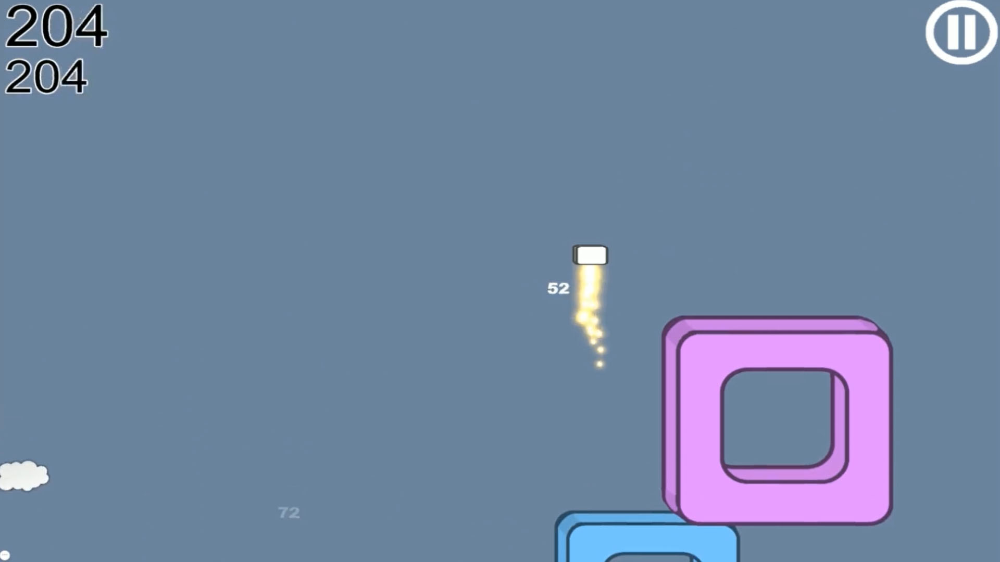

# Marshmallow - Phaser3 game using Typescript and webpack

Fast-paceed jumper game for the browser. Climb as high as possible and beat your highscore to unlock new abilities! 
Watch out for the falling heavy blocks and the lava raising from below.

## Demo

[https://davjo664.github.io/marshmallow](https://davjo664.github.io/marshmallow)




## Usage

### Install Typscript

```
npm install typescript -g
```

### Start

```
$ git clone https://github.com/davjo664/marshmallow
$ cd marshmallow
$ npm install
$ npm run dev
```

### Build

```
$ npm run build
```